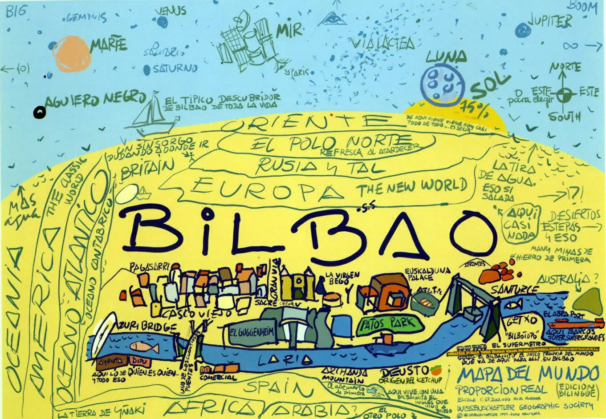

Este texto fue originalmente publicado por primera vez en el blog de <a href="https://pikasle.com/pikasle_es.html">la revista $\pi kasle$</a> para participar en la <a href="http://matesdedavid.blogspot.com/2014/03/edicion-52-emmy-noether_10.html">Edición 5.2 Emmy Noether del Carnaval de Matemáticas en marzo de 2014</a> cuyo anfitrión fue <a href="http://matesdedavid.blogspot.com/">Matesdavid</a>. Junto con <a href="https://culturacientifica.com/2014/03/26/un-puzzle-sencillo/">&ldquo;Un puzzle sencillo&rdquo;</a> del <a href="https://culturacientifica.com/">Cuaderno de Cultura Científica</a>, obtuvo <a href="http://eliatron.blogspot.com/2014/04/premio-carnamat52.html">el premio al mejor post de dicha edición del carnaval</a>.

 

**Advertencia:** En caso de procedencia guipuzcoana, se recomienda la no lectura de la presente
entrada al poder herir sensibilidades personales.

Toda persona, ya sea de Bilbao o no, ha visto alguna vez este mapa[^MB]:

¿Qué significa este mapa? ¿Qué representa? Aunque muchos/as no lo sepan, representa la topología verdadera del universo. Y es que el universo no es un toro (donut), una bola o un espacio euclídeo, el universo está centrado en Bilbao. Bilbao está en todas partes. Da igual donde te encuentres, Bilbao siempre está cerca de ti porque es la capital del universo. Por ello, la
topología del universo es la topología Bilbao-inclusión.

[^MB]: _Nota no presente en el post original:_ El mapamundi bilbaíno, cuyo título original es _Map of the World_, es una obra del artista vasco Juan Echegoien Krug y que firmó como JEK Larson del Wissenschaftler Art Group, New York. [Más información en este artículo de Isabel Ibañez en _El Correo_](https://www.elcorreo.com/bizkaia/201601/26/quien-dibujo-mapamundi-bilbao-20160119104605.html).

***
