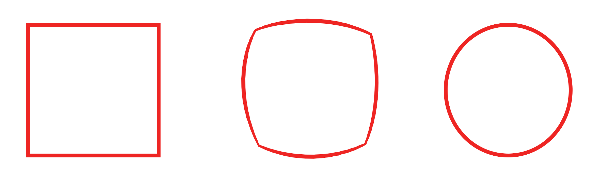

One afternoon, while killing my time in the lavatory, I was watching some youtube shorts. At some moment, the youtube algorithm decides to show me the video of some anti-trans right-wing extremist[^who] arguing that the problematization of gendersex[^FS] by many gender scholars[^butler] is senseless. The transcription of his speech is the following (emphasis mine):

>If somebody comes along, just one random wacko, and says that a circle is a shape with four equal straight sides and four right angles, I would say: &ldquo;No, that's a square. Squares are not circles, you idiot.&rdquo; But I don't think I would go giving any college lectures about it. I probably wouldn't make any documentary films on the subject.
>
>*But if there were to suddenly arise a well-coordinated and well-funded movement to convince the world that geometry is fluid and that squares are circles and circles are squares; and if this movement captured the minds of millions of people, especially young people*; then I would probably make a film called &ldquo;what is a square?&rdquo; and spend lots of time engaging on that topic, because I have to share this with everybody else.
>
>And when there are people who are trying to create a society that is not grounded in reality, that matters to me, because I want to be in reality. I might not like everything about reality all the time, but it still is not a good thing to live in a society that has lost its grip on reality.

My laughter after hearing this was enormous. Why? Because the metaphor is all wrong. Of course, this is an example when people believes they know mathematics. Funnily, this attitude doesn't come from the uneducated masses, but from those who have studied a mathematically technical degree. Usually, these people believe that because their mathematical level is so above the general public, there are no mathematics beyond their domain of knowledge. However, as any mathematician knows, no matter how abstract you believe that something is, there is another mathematician for which this so very abstract notion is as concrete as the pencil in your hand.

## A rhetorical trick

Before explaining why the metaphor is wrong, I must point out that this metaphor is not an argument, but a rhetorical trick. The speaker is identifying masculine and feminine—gender[^dg]—with circles and squares. Of course, the difference between circles and squares is obvious. However, what does the difference between circles and squares tells us about the difference between the masculine and the feminine? In one word:

Nothing!

We cannot tell anything about the difference between genders from the difference between circles and squares—they have nothing to do with each other!

## Fluid geometry: another name for topology

After letting clear that the above metaphor is not an argument, we can now explain the reason of my laughter. Why does a mathematician laugh regarding the above metaphor? Isn't this _fluid geometry_ just nonsense? Well... Have you hear about topology? This area of mathematics studies the properties of geometric objects that remain invariant under continuous deformations. In other words, topology is sort of a fluid geometry, where we can transform the rigid geometric objects in a less rigid—more fluid—way. And, even more ironically, a circle and a square are the same topologically.

How are a circle and a square the same topologically? The idea is that we can continuously bend the edges of a squares until we get a circle, as illustrated in this image[^video].

Hence, allowing more flexible transformations, objects that were different under the more rigid ones become equivalent—the same. Of course, all this can be further formalized with more fancy words—homotopy equivalence, simplicial complex, etc.—but the point is showing that mathematically a circle and a square can be the same if seen from the appropriate mathematical standpoint: the standpoint of a topologist.

## Is mathematics so rigid?

Why was this metaphor used instead of another one? Mathematics has this fame of being rigid, of being just one way: there is just one correct answer. From this perspective, it does not make sense to speak about different standpoints in mathematics: either circles and square are the same or are different. However, reality is more complex, even in the Pythagorean realm[^py]. Even when we look at simple mathematical objects like circles and squares, we can have different standpoints to look them from—in this case, the geometric and the topological—. Each of these standpoints emphasizes different aspects of these objects and learning how to see from each one of them enriches our mathematical understanding. Hence, even within the mathematical universe, different ways for structuring the world appear as we, humans, position ourselves at our mutually different standpoints.

Historically, not all mathematical standpoints are developed uniformly. There are many reasons for this. However, the biggest one is that not all of them get equal representation among mathematicians: overrepresentation and underrepresentations of mathematical standpoints is inevitable—some standpoints become stronger (more mathematicians, more funding, easier to progress...) than others. Hence some mathematical standpoints are just undeveloped because the proper material conditions for their development didn't arise. Of course, this doesn't mean that mathematical progress is arbitrary in the sense that anything can be proven, but that it is arbitrary (to a certain extent) as to what kind of results are favor.

And once we arrived here, we should be careful. In mathematics—and, more generally, in science—, a result will not just happen because a certain standpoint wants that result. The research program of a mathematical standpoint might fail or, more usually, stagnate. Now, we should not think that because we have always think about a particular object just in one way, this is because there is just one way—one standpoint from which—to think the object. Another way might exist, and we should be open to this possibility. Mathematics is not rigid, but fluid, and new possibilities open as we explore its Pythagorean reality from different mathematical standpoints. And the same happens with the reality we live in.

***

[^who]: Some of you will wonder who the person is. However, I don't think that giving the name will add anything to the points I am trying to make.<!--https://www.youtube.com/shorts/S8WC58D0h6M-->

[^FS]: I use the term _gendersex_ following the use of the term _gender/sex_ by [the biologist Anne Fausto-Sterling](https://en.wikipedia.org/wiki/Anne_Fausto-Sterling) in the book [_Sex/gender: Biology in a Social World_](https://books.google.com/books?id=BhbJUlZvYwEC)—although the term was originally introduced by biopsychologist Sari van Anders. With this decision, I am only following a recent trend among some thinkers in trying to think beyond dualisms. For example, in this respect, [the philosopher Donna Haraway](https://en.wikipedia.org/wiki/Donna_Haraway) introduced the term _natureculture_ to think beyond the nature vs. culture divide in the book [_The Companion Species Manifesto: Dogs, People, and Significant Otherness_](https://books.google.com/books/about/The_Companion_Species_Manifesto.html?id=hbjCzQEACAAJ).

[^butler]: Among these scholars, the most well-known is [the philosopher Judith Butler](https://en.wikipedia.org/wiki/Judith_Butler).

[^gd]: Note that I am not claiming that gender is dual—masculine and feminine—, but that's what the speaker is affirming.

[^video]: Or, even better, [shown in this video](https://www.youtube.com/watch?v=pFEYzWf-gk8).

[^py]: Why Pythagorean realm and not Platonic world? Because Pythagoreans had a mathematical world kind of earlier.
