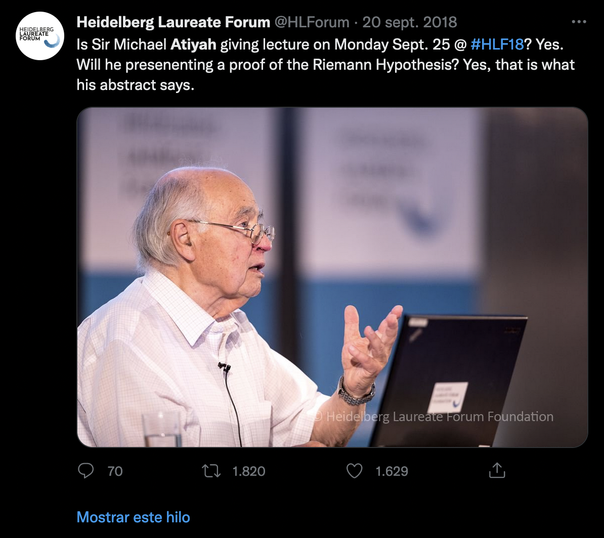

During the [6th Heidelberg Laureate Forum (6HLF)](https://www.heidelberg-laureate-forum.org/forum/past-hlfs/6th-hlf-2018.html)[^HLFdesc], I had the chance of meeting in person the legendary [Michael Atiyah](https://en.wikipedia.org/wiki/Michael_Atiyah). Even if one was unfamiliar with his mathematical work, Atiyah had passed to the collective consciousness of mathematicians all around the world and all around this science thanks to his famous book together with [Ian G. Macdonald](https://en.wikipedia.org/wiki/Ian_G._Macdonald): [*Introduction to Commutative Algebra*](https://www.maa.org/press/maa-reviews/introduction-to-commutative-algebra). This book has been a classic in the teaching of commutative algebra since the 80s and, despite its shortcomings, it has the advantage of being a short introduction when compared to other books in the topic—including those published nowadays.

[^HLFdes]:  The [Heidelberg Laureate Forum (HLF)](https://www.heidelberg-laureate-forum.org/) is a conferences where young people interact and socialize in an informal way with some of the great figures—meaning people who have won one of the great awards or prizes—of mathematics and computer science. By doing so, the conference expect to inspire the new generation of mathematicians and computer scientists to come.

# The Moment Itself in which I met Atiyah

The day was September 26, 2018. On the afternoon, we were making a boat-tour along [the river Neckar](https://en.wikipedia.org/wiki/Neckar) where the point was not so much to see the river banks as to interact with the people in the boat, among those you could find many laureates. Of course, knowing that Atiyah would be at the encounter, I had brought with me my copy of the famous commutative algebra book that had accompanied me so many hours and days during voyages through the world of algebra. As other days during the 6HLF, I carried with me the book ready to get a signature from Atiyah, but not without nervousness.

During that boat-tour, the awaited moment arraived. Atiyah had finished talking to a group and he was alone, an window of opportunity has just opened. Nervous as expected, [Giulia Codenotti](https://www.math.uni-frankfurt.de/~codenott/)—at the time doing the PhD also in the [Berlin Mathematical School](https://www.math-berlin.de/)—gave the final push for me to approach—that's what friends are for. So we approach Atiyah, and the conversation started, more through the talkativeness of Atiyah than by our own.

 
<a href="https://www.flickr.com/photos/hlforum/44944651071/in/album-72157701391916054/">&copy;2018 HLFF</a>
<!--Twitter: Peter Huxford (@pjhuxford)-->

The conversation was very one-sided, but none of the listeners there—[Peter Huxford](https://math.uchicago.edu/~huxford/), Giulia or myself—complained, since it is not everyday that you get this window to the life stories of a living legend. Atiyah talked about his personal background (including his Lebanese origins on the father's side) and share some stories about his life, which unfortunately were told too long ago for me to remember.

Of course, during the conversation, like any regular fanboy, I asked for a signature—an autograph—for the book and got it. Because of this, the conversation turned towards the book. Atiyah recalled how the book came to be as a product of a series of lectures he gave when he was young. The book came out as the lecture notes of that class, where Macdonald took care of the exercises. Funnily, he complained of how he still received questions about the exercises, complaining of how hard some of these were and how he didn't have anything to do with them.

# The Sad Circumstances of this Moment

Unfortunately, this moment didn't happen in the best circumstances. The 6HLF is infamous for Atiyah's presentation of his 'proof' of [Riemann hypothesis](https://en.wikipedia.org/wiki/Riemann_hypothesis). The presented proof was more the proof of a crank than the proof of a mathematical genius such as Atiyah, and it ruined whatever reputation he preserved as an active mathematician. Of course, he will always be remembered as a great mathematician, but that talk was the fall from grace and one of the saddest way for such a mathematician to end his career. However, why was Atiyah allowed to give such a talk in such a public forum as the 6HLF? And more importantly, what does this say about the mathematical community?

At the closing ceremony of the 6HLF, possibly due to the backslash against Atiyah's presentation, the HLF used academic freedom as a shield claiming that the speakers at the HLF have the academic freedom to talk about whatever they want. Thus the only responsible person regarding Atiyah's talk was Atiyah himself. Unfortunately, this line of thought obviates the responsability that the HLF has in all this, more so, when we take into account that Atiyah's proof of Riemann hypothesis was rejected by the [arXiv](https://arxiv.org/)[^arxiv_note]. If we accept the version of the HLF, then we should go and claim that arXiv is against academic freedom, a claim that is a contradiction in terms—with the possible exception of [Sci-Hub](https://en.wikipedia.org/wiki/Sci-Hub)[^scihub_note], no other platform has done more for free and open science than arXiv.

[^arxiv_note]:  For those outside mathematical research, the arXiv is a preprint server where mathematicians upload their manuscripts so that they are available to the wider mathematical community freely and openly. As of today, almost every mathematician upload Eir manuscript to arXiv when finishing it so that other mathematicians can access their work while the manuscript is undergoing the review process, which in mathematics can take years—in other areas, the review process is definitely shorter. In this way, a lot of the manuscripts in arXiv are raw documents which can contain typos and erros. In this way, it is very uncommon for arxiv to reject a manuscript.

[^scihub_note]:  SciHub is a very controversial online platform that provides free access to scientific books and papers without any regard to copyright. As of today, many researchers—including myself—can access certain papers, which lie behind a paywall, only through Sci-Hub.

Before following, let's reconstruct in detail the events[^1]. At some moment, Atiyah believed that he found a "simple proof" of Riemann hypothesis. Because of this, he communicates to the HLF that he will be talking about his proof and submits a preprint with the proof to the arXiv. While the arXiv rejects the preprint, the HLF does not only let Atiyah talk about his "simple proof", but puts him to speak the first day and starts announcing this through social media and mass media[^media]. What was the objective of this? To promote the HLF to the maximum possible level, because the HLF was not now a conference where old well-stablished mathematician connect to young aspiring mathematicians, but the conference were the genius of Michael Atiyah would announce his proof of the Riemann hypothesis.

 
<a href="https://twitter.com/HLForum/status/1042670700652318720">Example of the media hype created around Atiyah's talk</a>

[^1]:  These timeline of events was told in private conversation with the personal research assistant of Atiyah at the time. For the sake of responsability, I will not reveal this person's identity—one thing is putting myself on the line of fire, other thing is to put other people in that line. <!--[Carlos Zapata Carratalá](https://czapatacarratala.wixsite.com/home) @ZapataCarratala-->

[^media]:  To put some examples: ....

As a consequence of this media hype, all the eyes of the mathematical world were on Atiyah at his HLF talk. Moreover, this is not a metaphorical figure, since [the talks at the HLF are recorded and streamed]() for everyone to watch. Of course, this made the fall of Atiyah bigger, as he didn't give his talk only to the attendees at the HLF, but to the whole world. Because of this

At this moment, we can contextualize better the actions of HLF,

Now,

the HLF received the notice by Atiyah that he will be talking about Riemann hypothesis and that he will present his proof. Even if Atiyah made the claim that he had a " simple proof",

Taking into account that the talks of the HLF are streamed and recorded, accessible for all the people in the world, the HLF has a responsability in how it broadcasts the image of mathematicians to the world.

could we really use Academic freedom as a shield?

obviates the obvious: the program of the HLF is decided in advance.

 , about the benefits of Academic freedom, but what if some of the speakers wanted to talk about the mathematics of bomb-making? Would the HLF claim the same values for freedom,  were these claims reales

alone and not to take any responsability about the fact, since the actions of another person do not form part of our responsabilities. [^1]

***
